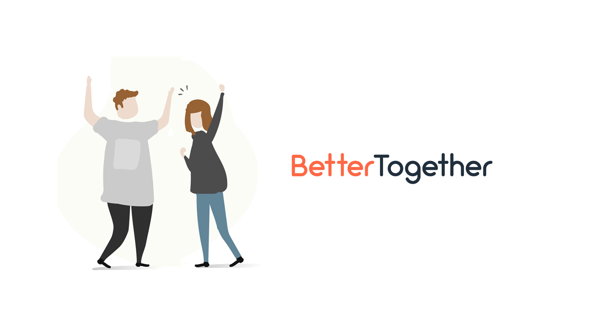

# BetterTogether

## Description

- **BetterTogether**, our web application that can be implemented and used for optimizing efficiency in money expenditure by finding other people nearby your area, who could share costs on your food, rides or promotions that you found throughout your daily life. It’s a great way to get to know other people and save money at the same time. A great benefits for everybody. The user can create their account on our web application and start using our 3 services (features)

## Team Members
| Name | Student ID | Role | GitHub |
| --- | --- | --- | --- |
| Thanida Jongarnon | 6110545538 | Developer | [bameethanida](https://github.com/bameethanida) |
| Pawaris Wongsalung | 6110545562 | Developer | [kabilza](https://github.com/kabilza) |
| Chananya Photan | 6110545481 | Developer | [forfeen](https://github.com/forfeen) |
| Nattapol Boonyapornpong | 6110545503 | Developer | [bleachjade](https://github.com/bleachjade) |

## Project documents
- ***[Iteration Plans](https://docs.google.com/document/d/12p_Q9lJGcFmxHFXDqpTGRPNsecd8QeMzd4vc9adesV8/edit?usp=sharing)***
- ***[Trello Board](https://trello.com/b/LlTAdYnN/bettertogether)***
- ***[Project Proposal](https://docs.google.com/document/d/1llsbVdOLaALymVtk0Ri6rGM3YudRvHal9JsArOEHnYU/edit#)***
- ***[Mockups Design](https://drive.google.com/drive/u/1/folders/1sMbkb3lHPt1bKVLKOyiRq-pkF06_ePIt)***