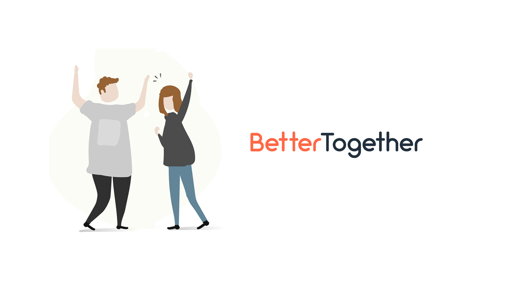

# BetterTogether
[](https://travis-ci.com/bameethanida/BetterTogether)  [](https://codecov.io/gh/bameethanida/BetterTogether)

<p align="center" >
  
</p>  
<font size ="4"> <b>BetterTogether</b> , our web application that can be implemented and used for optimizing efficiency in money expenditure by finding other people nearby your area, who could share costs on your food, rides or promotions that you found throughout your daily life. It’s a great way to get to know other people and save money at the same time. A great benefits for everybody. The user can create their account on our web application and start using our 3 services (features)</font size>

## Team Members
| Name                      | Roles                    | GitHub                                                |
|---------------------------|--------------------------|-------------------------------------------------------|
| Thanida Jongarnon         | Developer                | [bameethanida](https://github.com/bameethanida)       |
| Pawaris Wongsalung        | Developer                | [kabilza](https://github.com/kabilza)                 |
| Chananya Photan           | Developer                | [forfeen](https://github.com/forfeen), fifincny       |
| Nattapol Boonyapornpong   | Developer                | [bleachjade](https://github.com/bleachjade)           |

<b>Project documents</b>
<font size = "3">
---
- ***[Iteration Plans](https://docs.google.com/document/d/12p_Q9lJGcFmxHFXDqpTGRPNsecd8QeMzd4vc9adesV8/edit?usp=sharing)***
- ***[Iteration script and Review checklist](https://docs.google.com/document/d/1gTIWK_j4zq2iye9BwMY-_iJL65G4-hXLypDWlyjXnyU/edit?usp=sharing)***
- ***[Trello Board](https://trello.com/b/LlTAdYnN/bettertogether)***
- ***[Project Proposal](https://docs.google.com/document/d/1llsbVdOLaALymVtk0Ri6rGM3YudRvHal9JsArOEHnYU/edit#)***
- ***[Mockups Design](https://drive.google.com/drive/u/1/folders/1sMbkb3lHPt1bKVLKOyiRq-pkF06_ePIt)***

<b>Prerequisite </b>
<font size = "3">
---
- [Python](https://www.python.org/downloads/) 3.6 or newer 
- [Django](https://docs.djangoproject.com/en/2.2/topics/install/) 2.1.2 or newer
- Heroku CLI
- Google OAuth API
- Python add-on modules as in [requirements.txt](requirements.txt)
- Local environment variable (Please ask permission to the project owner for the environment variables.)


<b>Get started (run locally)</b>
---
<font size ="3"> Clone the repository.
```
  $ git clone https://github.com/bameethanida/BetterTogether.git 
```
Change directory to `BetterTogether` directory.
```
  $ cd BetterTogether/
```
Create virtualenv in the directory and activate virtualenv.    
```
  $ virtualenv venv
```
On MacOS and Linux:
```
  $ source venv/bin/activate
```

#### On Windows:
```
  $ venv\Scripts\activate
```

Install all required packages and then run database migrations.
#### On MacOS and Linux:
```
  (venv) pip3 install -r requirements.txt
  (venv) python3 manage.py makemigrations
  (venv) python3 manage.py migrate
```

#### On Windows:
```
  (venv) pip install -r requirements.txt
  (venv) py manage.py makemigrations
  (venv) py manage.py migrate
```
Running the tests.
```
  (venv) cd django-poll/mysite
```
#### On MacOS and Linux:
```
  (venv) python3 manage.py runserver
```

#### On Windows:
```
  (venv) py manage.py runserver
```